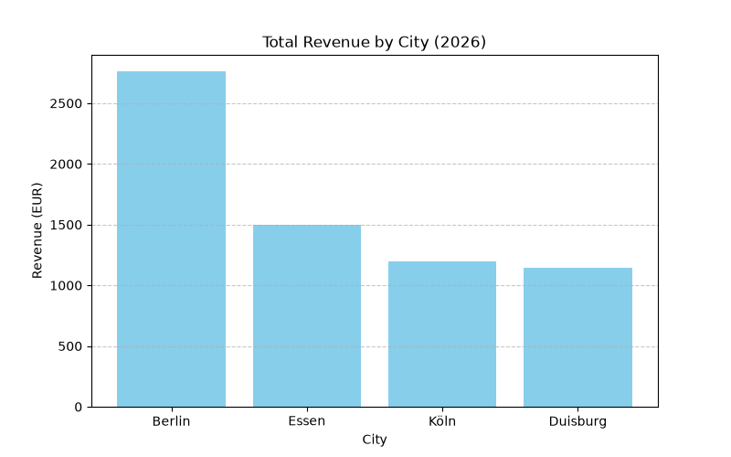

# E-Commerce Sales & Revenue Data Analysis

A Data Analysis project utilizing **Python** and **SQL** to extract, aggregate, and visualize sales data from a relational database.

## Project Overview
This project simulates an e-commerce database environment to analyze total sales revenue across different German cities.

### Key Features:
- **Database Management:** Created a relational database using `SQLite` and defined the data schema.
- **SQL Data Aggregation:** Used complex SQL queries (`SUM`, `GROUP BY`, `ORDER BY`) to analyze revenue distribution.
- **Data Visualization:** Processed data with `Pandas` and generated custom charts using `Matplotlib`.

---

## Tech Stack
- **Language:** Python 3.x
- **Database:** SQL / SQLite
- **Libraries:** `pandas`, `matplotlib`, `sqlite3`

---

## Visualizations & Results

### Total Revenue by City (2026)


---
## How to Run

1. Clone the repository:
   ```bash
   git clone https://github.com/mohmadaskari/Sales-Data-Analysis.git
   ```
2. Install dependencies:
   ```bash
   pip install pandas matplotlib
   ```
3. Run the script:
   ```bash
   python Main.py
   ```
   
   
